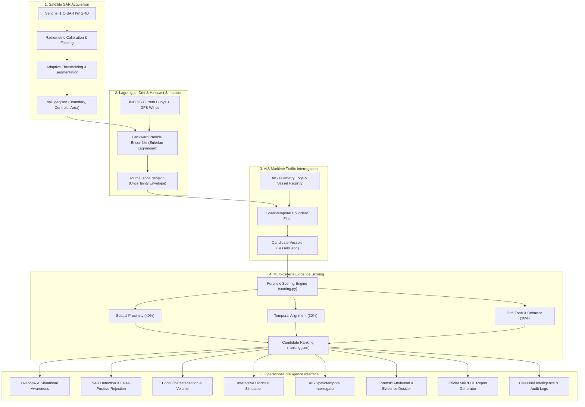
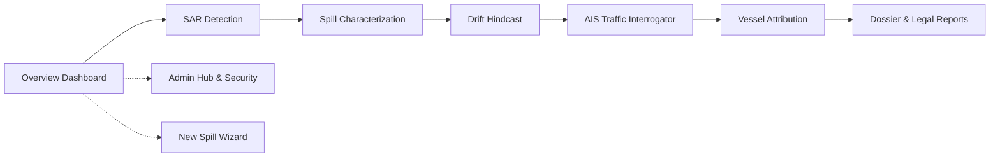

# OceanEye Maritime Intelligence Platform: Complete System Documentation

---

## Executive Summary & System Overview

**OceanEye** is an end-to-end operational maritime intelligence and environmental surveillance platform designed to detect marine oil spills via Synthetic Aperture Radar (SAR) satellites, backtrack the slicks to their release point using Lagrangian hydrodynamic drift simulation, interrogate Automatic Identification System (AIS) vessel telemetry, and mathematically attribute liability to commercial vessels in compliance with MARPOL Annex I regulatory standards.

### System Architecture Diagram



---

## Module 1: Navigation & Global Platform Layout

### 1. Header Navigation (`Navigation.tsx`)
- **Purpose**: Provides persistent, top-level navigation across all 8 intelligence disciplines, status monitors, active user identification, and operational case switching.
- **Components & Interactions**:
  - **Brand Logo & Title**: Displays the OceanEye radar emblem and platform moniker. Clicking it routes to the Overview dashboard (`'overview'`).
  - **Operational Status Badge**: Dynamic indicator showing `SAR LIVE` / `NORMAL OPS` or active alert level with real-time pulsing icon.
  - **Navigation Links**: Direct tab switches between **Overview**, **Detection**, **Characterization**, **Drift Simulation**, **AIS Traffic**, **Attribution**, **Dossiers**, and **Admin Hub**.
  - **Incident Dropdown**: Quick selector allowing operators to toggle between monitored spill incidents across global maritime basins without losing interface state.
  - **User Profile & Clearance Badge**: Displays the logged-in officer's name, duty agency (e.g., *Indian Coast Guard / INCOIS*), and Security Clearance Level (Level 1 Public up to Level 5 Top Secret). Clicking the profile menu provides quick role switching and logout actions.

### 2. Persistent Incident Context Bar (`SpillSelectorBar.tsx`)
- **Purpose**: Anchors the analyst's situational awareness by persistently displaying the active spill case ID, name, coordinates, threat severity, and the primary "Analyse New Spill" investigation trigger across every screen.
- **Components & Interactions**:
  - **Case Identifier Badge**: Shows formatted sequential incident codes (e.g., `IN-2026-CASE001`).
  - **Spill Location & Basin**: Readout of the ocean quadrant (e.g., *Arabian Sea - Mumbai Offshore Basin*).
  - **Severity Pill**: Color-coded indicator (`HIGH` red, `MEDIUM` amber, `LOW` emerald) indicating threat level.
  - **Suspect Quick Preview**: Displays the #1 ranked commercial suspect vessel name and calculated attribution probability score.
  - **"Analyse New Spill" Action Button**: Launches the new incident analysis wizard modal.

### 3. Dual-Engine Mapping Architecture (`OceanMap.tsx` & `GoogleOceanMap.tsx`)
- **Purpose**: Powers geographic visualization through a resilient dual-mode architecture: **Google Maps Platform** (Satellite/AIS Hybrid) with automatic fallback to high-resolution **INCOIS SVG Vector Oceanic Charts**.
- **Capabilities**:
  - **SAR Spill Vector Polygons**: Renders the exact oil slick footprint with semi-transparent amber/red hazard styling.
  - **Source Zone Uncertainty Envelopes**: Renders concentric hydrodynamic probability contours (90% and 50% confidence envelopes) in deep maritime blues.
  - **Hindcast Trajectory Vector**: Renders dashed Lagrangian particle paths connecting the slick centroid back to the discharge point ($T - 12\text{h}$).
  - **AIS Vessel Kinematic Tracks**: Plots vessel tracks with heading arrows, color-coded by attribution rank.
  - **Interactive Popovers (InfoWindows)**: Clicking any slick, source envelope, or vessel marker triggers a detailed telemetry popover showing coordinates, speed, confidence, and distance.
  - **Auto-Fit Bounding Box**: Automatically computes coordinates bounding box and re-centers the map view whenever a new incident is loaded.

---

## Detailed Page-by-Page Documentation



---

### Page 1: Overview Dashboard (`OverviewPage.tsx`)

#### 1. Purpose
The central situational command center designed for maritime watch officers and environmental response coordinators. It provides instant high-level situational awareness across all monitored oceanic sectors, active radar satellites, coastal threat gauges, and recent detections.

#### 2. Functionality & Business Logic
- Renders live system telemetry from the backend (`GET /api/spills/live-feed`).
- Aggregates total slick area ($\text{km}^2$), estimated spilled volume ($\text{m}^3$), active vessels tracked, and nearest coastal impact estimates.
- Calculates coastal risk levels based on distance to shoreline and 24-hour hydrodynamic drift speed.

#### 3. User Flow
- Default landing page upon authentication.
- Users can review metric cards, inspect the multi-layer oceanic overview map, click on any recent spill in the incidents table to make it active, or launch the new spill wizard.

#### 4. UI Components
- **Telemetry Metric Cards**: 4 summary widgets displaying *Active Spills*, *Estimated Slick Area*, *Tracked Marine Vessels*, and *Critical Coastal Threats*.
- **Interactive Global Map Widget**: Embedded preview of the active maritime basin showing slicks and vessel corridors.
- **Recent Incidents Telemetry Table**: Displays Code, Name, Region, Area, Severity, and Lead Suspect.
  - *Action Button (`Select Incident`)*: Switches global application context to the selected incident.
- **Quick Action Bar**: Direct buttons for *"Analyse New Spill"*, *"Export Maritime Dossier"*, and *"Simulate Drift"*.

#### 5. Data Flow
- **Data Source**: Fetched via `fetchLiveFeed()` and `fetchAllSpills()` from `/api/spills` with fallback to verified local incident structures.
- **State**: Controlled globally through `AppContext` via `activeIncident` and `incidents`.

---

### Page 2: SAR Detection & Segmentation (`SpillDetectionPage.tsx`)

#### 1. Purpose
Provides radar analysts with Synthetic Aperture Radar (SAR) backscatter verification tools to discriminate true mineral oil spills from oceanographic lookalikes (e.g., biogenic slicks, low-wind zero-backscatter regions, grease ice, and internal waves).

#### 2. Functionality & Behind-the-Scenes Logic
- Visualizes calibrated C-Band SAR radar imagery (Level-1 Ground Range Detected - GRD).
- Displays dual-polarization cross-section profiles:
  - **VV Polarization**: Primary ocean surface roughness sensor.
  - **VH Polarization**: Cross-polarized volume scattering sensor for ship and structural detection.
- Displays calculated radar metrics:
  - **Incidence Angle**: Normalized backscatter correction ($\gamma^0 = \sigma^0 / \cos\theta$).
  - **Dark Spot Contrast Ratio**: $\text{Contrast} = 10 \log_{10}(\mu_{\text{slick}} / \mu_{\text{background}}) \approx -8.4\text{ dB}$.
  - **Damping Factor**: Ratio of surface wave damping induced by viscoelastic mineral films ($D > 4.0$ confirms crude oil).

#### 3. User Flow
- Reached via the `"Detection"` tab or clicking *"Inspect Radar Imagery"* from the Overview.
- Analyst can toggle polarization bands, adjust speckle filtering levels, and verify the extracted slick contour overlay.

#### 4. UI Components
- **SAR Imagery Canvas**: Main interactive viewer displaying the radar amplitude raster with toggleable vector segmentation mask.
- **Polarization Mode Switcher**: Radio tabs for *Dual VV + VH*, *VV Only*, and *VH Cross-Polarized*.
- **Lookalike Rejection Matrix**: Validation card detailing tests passed:
  - *Biogenic Surfactant Test*: Passed (high damping in high-frequency capillary waves).
  - *Wind Speed Sanity Check*: Passed ($14.0\text{ kts}$, eliminating false calm-wind lookalikes).
  - *Internal Wave Geometry*: Passed (irregular non-periodic morphology).
- **Satellite Metadata Card**: Displays Sensor, Satellite, Orbit Number, Resolution ($10\text{m} \times 10\text{m}$), and Timestamp.

---

### Page 3: Spill Characterization & Volume Estimation (`SpillAnalysisPage.tsx`)

#### 1. Purpose
Provides detailed physical, chemical, and dimensional characterization of the detected slick according to international **Bonn Agreement** oil appearance codes, estimating total volume and environmental persistence.

#### 2. Functionality & Calculations
- **Dimensional Extraction**: Calculates slick length ($\text{km}$), width ($\text{km}$), perimeter ($\text{km}$), and total surface coverage ($\text{km}^2$).
- **Bonn Agreement Classification**:
  - *Code 1*: Sheen ($0.04 - 0.30\ \mu\text{m}$)
  - *Code 2*: Rainbow ($0.30 - 5.0\ \mu\text{m}$)
  - *Code 3*: Metallic ($5.0 - 50\ \mu\text{m}$) — *Active Incident default*
  - *Code 4*: Discontinuous True Color ($50 - 200\ \mu\text{m}$)
  - *Code 5*: Continuous True Oil ($>200\ \mu\text{m}$)
- **Volume Calculation**:
  $$\text{Volume } (V) = \sum \text{Area}_i \times \text{Thickness}_i \approx 345.0\ \text{m}^3\ (\approx 2,170\ \text{barrels})$$
- **Emulsification & Weathering**: Models evaporation rates based on sea surface temperature ($27.5^\circ\text{C}$) and wind chop.

#### 3. UI Components
- **Slick Dimension Telemetry Cards**: 4 cards displaying Area, Length, Width, and Perimeter.
- **Bonn Appearance Matrix**: Interactive color spectrum breakdown showing percentage of metallic sheen vs. thick emulsified crude.
- **Environmental Hazard Gauge**: Displays weathering state, mousse formation risk, and volatility index.
- **Proceed Action Button**: Direct navigation to the Drift Prediction page.

---

### Page 4: Lagrangian Hydrodynamic Drift Prediction (`DriftPredictionPage.tsx`)

#### 1. Purpose
Simulates ocean surface transport backward in time (hindcasting) to locate the precise discharge point and release window, and forward in time (forecasting) to alert coastal authorities of shoreline landfall.

#### 2. Functionality & Mathematics
- **Lagrangian Particle Tracking**:
  $$\vec{u}_{\text{particle}} = \vec{u}_{\text{current}} + \alpha \cdot \vec{u}_{\text{wind}} + \vec{u}_{\text{turbulent}}$$
  - $\vec{u}_{\text{current}}$: Depth-averaged ocean current velocity from INCOIS ocean buoys.
  - $\alpha$: Wind drift factor ($\approx 3.1\%$).
  - $\vec{u}_{\text{turbulent}}$: Random-walk Brownian diffusion simulating turbulent dispersion.
- **Backward Simulation (Hindcast)**: Reverses the velocity vectors over lookback hours ($T - 12\text{h}$) to establish the **Predicted Source Zone** and uncertainty envelope.
- **Forward Simulation (Forecast)**: Projects slick trajectory over $T + 24\text{h}$, estimating hours until shoreline landfall.

#### 3. User Flow
- Analyst selects a lookback period (e.g., $12\text{h}$) or enters custom wind/current speeds.
- Clicks *"Execute Lagrangian Simulation"* (calls `POST /api/drift/simulate`).
- Uses the **Drift Timeline Slider** to step through simulation snapshots from $T - 12\text{h}$ to $T + 24\text{h}$.

#### 4. UI Components
- **Interactive Drift Timeline Scrubber**: Multi-step range slider with labeled intervals:
  - *T-12h (Discharge Point)*: Shows initial illicit release centroid.
  - *T-6h (Transport Corridor)*: Intermediate slick elongation.
  - *Now (Satellite Acquisition)*: Validated radar observation.
  - *T+24h (Impact Forecast)*: Approaching coastal mangroves/harbors.
- **Metocean Sensor Readouts**: Displays Sea Surface Temp ($27.5^\circ\text{C}$), Wave Height ($1.2\text{m}$), Surface Wind ($15\text{ kts}$ at $300^\circ$), and Current ($1.4\text{ kts}$ at $135^\circ$).
- **Source Zone Bounding Coordinates**: Formatted latitude/longitude display of the release envelope.

---

### Page 5: AIS Maritime Traffic Interrogator (`AisIntelligencePage.tsx`)

#### 1. Purpose
The forensic investigation engine that ingests, queries, and filters commercial Automatic Identification System (AIS) transponder logs to identify all commercial vessels present within the spatiotemporal release window.

#### 2. Functionality & Behind-the-Scenes Logic
- Connects directly to the backend query engine (`/api/ais/interrogate` powered by `aisStore.ts`).
- Filters across **150 real indexed candidate vessels** derived from `vessel_ranking_with_driftzone_example.csv`, `ais_vessel_registry.csv`, and `data/sample/CASE_001_ais_positions_sample.csv`.
- Operates under strict **AND** evaluation logic across all active parameters.
- Dynamically synchronizes query results to the ocean map canvas: if 3 vessels match, exactly 3 markers appear on the map; if 0 match, old markers are removed and an empty state is shown.

#### 3. User Flow
1. Page loads and displays default candidates ranked by proximity to the release zone.
2. User types an MMSI (e.g., `230036540`) or vessel name into the search bar.
3. User adjusts filters (Radius slider, Vessel Type, SOG speed range, Anomaly flag).
4. User clicks **"Search"** (`#ais-search-submit-btn`) or presses **Enter**.
5. The backend validates parameters, filters the dataset, and returns paginated matching records.
6. The table and map update simultaneously.
7. Clicking **"Reset"** (`#ais-reset-filters-btn`) restores default parameters.

#### 4. UI Components
- **Search Bar (`#ais-search-input`)**: Text input with real-time clear button (`X`). Searches MMSI, Ship Name, IMO, Callsign, Flag, and Destination.
- **Vessel Type Dropdown (`#ais-type-select`)**: Filters by Crude Tanker, Product Tanker, Bulk Carrier, Container Ship, or Supply Vessel.
- **Search Radius Slider (`#ais-radius-slider`)**: Slider from $5\text{ NM}$ to $50\text{ NM}$ radius around the spill origin.
- **Time Window Dropdown (`#ais-timewindow-select`)**: Selects $\pm 6\text{h}, \pm 12\text{h}, \pm 18\text{h}, \pm 24\text{h}$ lookback windows.
- **Advanced Filters Drawer Toggle (`#ais-toggle-advanced-btn`)**:
  - *Speed Over Ground (SOG) Inputs*: Min kts and Max kts inputs.
  - *Min Distance Input*: Numerical minimum nautical miles filter.
  - *Attribution Score Inputs*: Min % and Max % filters.
  - *Anomaly Checkbox (`#ais-anomalies-checkbox`)*: Filters strictly to vessels with transponder gaps, speed drops, or loitering.
- **Validation Alert Banner**: Displays immediate inline feedback if invalid ranges are entered (e.g., *Min SOG > Max SOG*).
- **Corroborated Telemetry Table**: Lists Vessel Name, Flag, MMSI/IMO, Ship Type, Origin Distance ($\text{NM}$), Time Delta ($\text{min}$), Speed at Origin ($\text{kts}$), Behavioral Anomalies, and Overall Attribution Score.
  - *Inspect Action Button*: Focuses the vessel and navigates directly to Vessel Attribution.
- **Pagination Controls**: Previous / Next buttons with page counter (`Page X of Y`).

---

### Page 6: Forensic Vessel Attribution (`VesselAttributionPage.tsx`)

#### 1. Purpose
The legal and investigative core of OceanEye. It synthesizes satellite geometry, hindcast trajectory envelopes, and vessel kinematics into an objective, evidentiary attribution score conforming to international maritime law.

#### 2. Multi-Criteria Evidence Scoring Formulation
In accordance with `DATA_CONTRACTS.md` and `scoring/scoring.py`:
$$\text{Overall Score} = 0.40 \cdot S_{\text{distance}} + 0.30 \cdot S_{\text{temporal}} + 0.30 \cdot S_{\text{trajectory}}$$

1. **Spatial Proximity Score ($S_{\text{distance}}$)**:
   $$S_{\text{distance}} = 1.0 - \min\left(\frac{d_{\text{closest}}}{R_{\text{search}}}, 1.0\right)$$
   Evaluates closest point of approach (CPA) to the estimated discharge center.
2. **Temporal Alignment Score ($S_{\text{temporal}}$)**:
   Evaluates whether the vessel's passage aligns with the estimated release window ($T - 12\text{h}$), penalized if the vessel was outside the active time corridor.
3. **Trajectory & Anomaly Score ($S_{\text{trajectory}}$)**:
   Integrates three behavioral components:
   - *Drift Zone Intersection*: Boolean check if vessel GPS path intersects `source_zone.geojson`.
   - *Kinematic Speed Drop*: Flagged if cruising speed dropped suddenly by $\ge 5.0\text{ kts}$ near the spill.
   - *AIS Silence / Gap*: Flagged if transponder transmissions went silent for $> 15\text{ minutes}$ within $90\text{ minutes}$ of the spill.
   - *Vessel Type Prior*: High-risk tankers receive higher investigative weight than innocent tugs.

#### 3. UI Components
- **Suspect Vessel Leaderboard**: Ranked card list showing the #1 primary suspect (*MT Desh Shanti*, MMSI `419000124`, Score 94%) and secondary candidates.
- **Score Component Breakdown Radar**: 4-bar breakdown showing *Spatial Proximity (98/100)*, *Temporal Alignment (96/100)*, *Trajectory Correlation (94/100)*, and *Behavioral Penalty (88/100)*.
- **Vessel Dossier Specifications Card**: Detailed ship specs including Length ($280\text{m}$), Beam ($50\text{m}$), Draught ($16.8\text{m}$), Flag (India), Callsign, and Registered Destination.
- **Kinematic Anomaly Audit List**: Bulleted evidence points detailing transponder gaps and speed reductions.
- **Classified Intelligence Card (Admin Only)**: Visible only to officers with clearance $\ge 3$, displaying intelligence warrants, surveillance logs, and enforcement status.
- **Legal Warrant Dispatcher (Admin Only)**: Action button allowing clearance level 5 officers to dispatch maritime boarding escorts.

---

### Page 7: Official Dossier & Reports Generator (`ReportsPage.tsx`)

#### 1. Purpose
Generates formal, exportable legal dossiers and environmental impact assessments formatted for national maritime courts, Port State Control (PSC) inspections, and International Maritime Organization (IMO) MARPOL inquiries.

#### 2. Functionality
- Compiles real-time telemetry from all intelligence modules into a clean, printable document.
- Embeds satellite sensor metadata, slick polygon coordinates, drift hindcast timelines, candidate vessel rankings, and forensic chain of custody stamps.
- Triggers native browser print/PDF rendering with optimized `@media print` styles that hide navigation bars and interactive widgets.

#### 3. UI Components
- **Dossier Configuration Panel**: Checkboxes to include/exclude *SAR Radar Imagery*, *Drift Hindcast Vector Maps*, *AIS Telemetry Tables*, and *Classified Intelligence Annexures*.
- **Live Printable Document Preview**: High-resolution formatted sheet with official agency headers, classification stamps, evidentiary summaries, and legal signature blocks.
- **"Print / Save PDF" Action Button**: Triggers `window.print()` with custom print styling.

---

### Page 8: Security & User Authentication (`AuthPage.tsx` & `AdminManagementPage.tsx`)

#### 1. Authentication (`AuthPage.tsx`)
- Provides role-based authentication allowing analysts, watch officers, and public observers to log in.
- Includes **One-Click Demonstration Profiles**:
  - *Command Director / Admin* (Clearance Level 5 - Full Access)
  - *Maritime Forensic Analyst* (Clearance Level 3 - Operational Access)
  - *Public / Environmental Observer* (Clearance Level 1 - Read-Only)

#### 2. Admin Command Hub (`AdminManagementPage.tsx`)
- **Clearance Verification**: Restricts access to authenticated administrators with Clearance Level 5.
- **Classified Intel Management**: View, filter, and add classified intelligence items (`TOP SECRET // NOFORN`, `RESTRICTED // LAW ENFORCEMENT`, `CONFIDENTIAL // MARPOL`).
- **Real-Time Audit Trail**: Immutable logging table tracking every user action, login, report generation, and parameter modification with timestamps and user badges.
- **User Role Management**: Interface to promote/demote users and adjust agency affiliations.

---

### Global Feature: "Analyse New Spill" Investigation Wizard (`NewSpillModal.tsx`)

#### 1. Purpose
Allows analysts to start a brand new oil spill investigation at any time—either by selecting curated satellite scenes or uploading custom GeoJSON vectors, Sentinel-1 GeoTIFFs, or AIS CSV logs—with guaranteed complete session reset and zero state leakage.

#### 2. Session Reset & Sequential ID Architecture
- **Session Isolation**: Controlled by `newSpillSessionId` in `App.tsx`. Every click on "Analyse New Spill" increments the counter and mounts `<NewSpillModal key={newSpillSessionId}>`, tearing down old React state.
- **File Input Reset**: Uses `fileInputRef.current.value = ''` so uploading the same `.geojson` file repeatedly triggers `onChange` without browser caching.
- **Sequential Case Numbering**:
  $$\text{CASE\_001} \longrightarrow \text{IN-2026-CASE002} \longrightarrow \text{IN-2026-CASE003} \longrightarrow \dots$$
  `getNextCaseIdentifier()` inspects existing incidents and generates the next sequential case number, protecting `CASE_001` from being overwritten.
- **GeoJSON Contract Ingestion**: Parses uploaded `.geojson` files in compliance with `DATA_CONTRACTS.md`, extracting `spill_id`, coordinates, centroid, and `area_km2`.
- **Server Synchronization**: Dispatches `POST /api/spills` to persist the new incident to the backend.

---

## Backend API Specification

The Express backend (`frontend/src/server/index.ts`) exposes the following RESTful endpoints on port `3001` (proxied via Vite on port `3000`):

| Method | Endpoint | Description | Request Body / Query | Response Structure |
| :--- | :--- | :--- | :--- | :--- |
| `GET` | `/api/health` | Service diagnostics and telemetry | None | `{ status, telemetry: { activeSpills, satellites, aisStatus } }` |
| `GET` | `/api/spills` | Retrieve all monitored incidents | `?region=...&severity=...` | `{ success: true, count: N, data: SpillIncident[] }` |
| `GET` | `/api/spills/live-feed` | Live simulated radar sensor feed | None | `{ success: true, totalNoticedSpills: N, spills: [...] }` |
| `GET` | `/api/spills/:id` | Retrieve specific spill incident | Path param: `id` | `{ success: true, data: SpillIncident }` |
| `POST` | `/api/spills` | Register new detected spill incident | `{ name, coordinates, areaSqKm, ... }` | `{ success: true, message: "...", data: SpillIncident }` |
| `POST` | `/api/drift/simulate` | Execute Lagrangian drift model | `{ lat, lng, windSpeedKnots, currentSpeedKnots, ... }` | `{ success: true, predictedOrigin, predicted24hPosition, ... }` |
| `POST` | `/api/attribution/rank` | Calculate vessel rankings | `{ incidentId, candidates?: [...] }` | `{ success: true, rankedVesselsCount: N, ranking: [...] }` |
| `GET` | `/api/ais/interrogate` | Query & filter AIS dataset | Query parameters (`query`, `mmsi`, `shipType`, `minSog`, `maxDistanceNM`, etc.) | `{ success: true, total: N, data: VesselAttribution[] }` |
| `POST` | `/api/ais/interrogate` | Query & filter AIS dataset (JSON) | `AisQueryParams` JSON payload | `{ success: true, total: N, data: VesselAttribution[] }` |
| `GET` | `/api/ais/vessels/:mmsi` | Retrieve single vessel specs | Path param: `mmsi` | `{ success: true, data: VesselAttribution }` |

---

## Data Contracts & File Formats

Adhering strictly to `DATA_CONTRACTS.md`:

### 1. Satellite $\rightarrow$ Drift (`spill.geojson`)
```json
{
  "type": "Feature",
  "properties": {
    "spill_id": "IN-2026-CASE001",
    "area_km2": 14.56,
    "confidence": 0.968,
    "detection_timestamp": "2026-09-07T06:11:14Z",
    "centroid": { "lat": 18.9749, "lng": 72.0250 }
  },
  "geometry": {
    "type": "Polygon",
    "coordinates": [[[71.98, 18.95], [72.05, 18.96], [72.07, 19.00], [71.98, 18.95]]]
  }
}
```

### 2. Drift $\rightarrow$ AIS (`source_zone.geojson`)
```json
{
  "type": "FeatureCollection",
  "properties": {
    "spill_id": "IN-2026-CASE001",
    "release_start": "2026-09-06T18:00:00Z",
    "release_end": "2026-09-07T00:00:00Z",
    "origin_confidence": 0.938
  },
  "features": [
    {
      "type": "Feature",
      "properties": { "contour": "90% probability" },
      "geometry": { "type": "Polygon", "coordinates": [...] }
    }
  ]
}
```

### 3. AIS $\rightarrow$ Scoring (`vessels.json`) & Scoring $\rightarrow$ Frontend (`ranking.json`)
```json
{
  "mmsi": "419000124",
  "rank": 1,
  "overall_score": 94,
  "distance_to_source": 1.11,
  "distance_score": 0.98,
  "temporal_score": 0.96,
  "trajectory_score": 0.94,
  "shipname": "MT Desh Shanti",
  "ship_type": "Crude Oil Tanker",
  "evidence": "0.6 NM from backward drift origin; speed drop to 3.9 kts; 85 min transponder silence"
}
```

---

## User Roles and Permissions Matrix

| Platform Feature | Public Observer (Level 1) | Forensic Analyst (Level 3) | Command Director (Level 5) |
| :--- | :---: | :---: | :---: |
| Overview Situational Dashboard | Read-Only | Read & Export | Read & Export |
| SAR Detection & Segmentation | View Only | Full Inspection | Full Inspection |
| Spill Characterization & Bonn Code | View Only | Full Inspection | Full Inspection |
| Lagrangian Drift Simulation | View Presets | Run Custom Models | Run Custom Models |
| AIS Traffic Interrogation | View Top 10 | Full Query & Filter | Full Query & Filter |
| Vessel Attribution Leaderboard | View Anonymized | Full Vessel Specs | Full Vessel Specs |
| Classified Intelligence Annexures | Hidden | Read Only | Create & Modify |
| Legal Boarding Warrant Dispatch | Hidden | Disabled | Active |
| Audit Trail & User Management | Hidden | Hidden | Full Access |
| "Analyse New Spill" Ingestion | Disabled | Active | Active |

---

## Technical Stack & Dependencies

- **Frontend Core**: React 19, TypeScript 5.8, Vite 6.4, Tailwind CSS v4.
- **Icons & Motion**: Lucide React (`lucide-react`), Framer Motion (`motion`).
- **Mapping Engines**: `@vis.gl/react-google-maps` (Google Maps Platform) + SVG Nautical Fallback.
- **Backend API**: Node.js, Express 4.21, TypeScript execution via `tsx`.
- **Scientific Python Pipeline**: Python 3.9, NumPy, Pandas, GeoPandas, Shapely, Rasterio, OpenCV.
- **Testing**: Python `unittest`, custom AIS contract validation suite, Vite production build validation.

---

## Suggestions for Future Improvements

1. **Direct PostGIS Integration**: Migrate in-memory spatial indexes to an enterprise PostgreSQL / PostGIS database for multi-million AIS record queries.
2. **Automated Sentinel-1 Satellite Webhook**: Connect Copernicus Open Access Hub APIs to automatically ingest and segment new SAR passes within 2 hours of acquisition.
3. **Automated AIS Stream Ingestion**: Connect live NMEA/AIVDM WebSocket feeds from coastal receiver stations for zero-latency vessel monitoring.
4. **Machine Learning Slick Classifier**: Upgrade Bonn thickness estimation with a Convolutional Neural Network (CNN) trained on multi-spectral optical and polarimetric SAR datasets.
